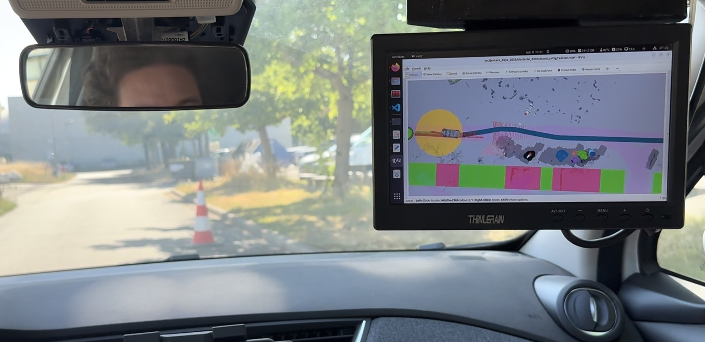

# jemaro_days_2025

The rosbag LiDAR dataset and the lane paths are available here: https://uncloud.univ-nantes.fr/index.php/s/tkEwQcM7qGMj9wp 

### Real Car Evaluation Video

Watch the real car evaluation video for the Jemaro Days 2025 competition:





## JEAMRO TEAM 1 Implementation

## Run the Code

### Replay Recorded Data
Replay the recorded LiDAR dataset with specific options:
```bash
ros2 bag play -l --start-offset 8 --rate 0.6 src/data/rosbag2_2025_06_26-10_27_18/
```

### Full Obstacle Detection and Path Planning Pipeline
Run the complete pipeline with RViz visualization:
```bash
ros2 launch obstacle_detection launch_obstacle_detection_real.launch.launch.py
```

### Path Planning Only
Run only the path planning module:
```bash
ros2 launch path_planning path_planning.launch.py
```

## Visualization

### Obstacle Detection Visualization
Launch RViz with the obstacle detection configuration:
```bash
rviz2 -d src/jemaro_days_2025/obstacle_detection/config/obstacle_detection.rviz
```

### Real Car Visualization
Launch RViz with the real car configuration:
```bash
rviz2 -d src/jemaro_days_2025/obstacle_detection/config/realcar.rviz
```


## Obstacle Detection

1. Cut off the point cloud.
2. Remove points in the road plane using RANSAC and retain them as road detection.
3. Remove low-intensity points.
4. Euclidean clustering to create clusters.
5. Remove clusters that are larger than a specified threshold in the x and y or smaller than a threshold in the z.
6. Remove clusters that contain more points than a threshold.
7. Remove clusters that are outside the road area in the x and y dimensions.

## Map Creation

1. Mlti-frame tracking: Track clusters based on their centroids. Clusters must be at least 4 frames old and are removed 120 frames after disappearing.
2. Draw the inflated area of tracked clusters on the map as black.
3. Draw road points on the map as white.
This node limits the LiDAR field of view to the front 60 degrees, segments the
ground plane using RANSAC, clusters the remaining points and publishes bounding
boxes for up to five obstacles.

## Path Planning
1. Subscribe the map data (`OccupancyGrid`) from the `/jemaro_map` topic, which is published by the obstacle detection node.

2. Each time new data is received, an optimal path is generated:

    2.1. Generate a straight path from the start point to the goal point.
    
    2.2. For each point on the path, check whether there is an obstalce within the specifued `safety_distance` distance.

    2.3. If an obstacle is detected, shifft the affected point to the left by `shift_distance`, then continue checking the following points.

    2.4. Once the rough path is generated,fill the gaps between points and apply smoothing to make the path coutinuous and navigable.

3. Publish the final path to the `/ZOE3/path_follower/setPath` topic every 4.5 seconds.

----
----

# Gazebo
The Gazebo prius environment is based on https://github.com/mattborghi/osrf_car_demo


Launch the Gazebo simulator with the straight road world and the prius:
```
ros2 launch car_demo straight_road.launch.py
```

Convert twist messages to the prius control messages:
```
ros2 launch twist_to_prius_cmd twist_to_prius_cmd.launch.py
```

Launch a basic pure pursuit path following algorithm:
```
ros2 launch car_control car_control.launch.py
```

Publish the path of the center of the lane and of the right and left sides of the road (only one time, use -l for multiple messages):
```
ros2 bag play path_prius
```
```
ros2 bag play path_right_prius --remap /path:=path_right
```
```
ros2 bag play path_left_prius --remap /path:=path_left
```

# LiDAR dataset

Launch rviz interface:
```
rviz2 -d jemaro.rviz
```

Publish the path of the center of the lane and of the right and left sides of the road (only one time, use -l for multiple messages):
```
ros2 bag play path_zoe --remap /ZOE3/path_follower/setPath:=path
```
```
ros2 bag play path_left_zoe --remap /ZOE3/path_follower/setPath:=path_left
```
```
ros2 bag play path_right_zoe --remap /ZOE3/path_follower/setPath:=path_right
```

Read the LiDAR dataset:
```
ros2 bag play rosbag2_2025_06_26-10_27_18
```

Launch the pointcloud downsampling node (based on https://github.com/LihanChen2004/pointcloud_downsampling):
```
ros2 launch pointcloud_downsampling pointcloud_downsampling.launch.py
```


